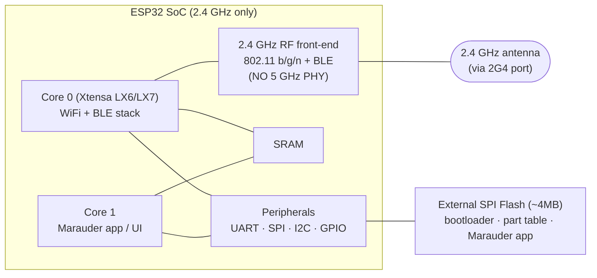
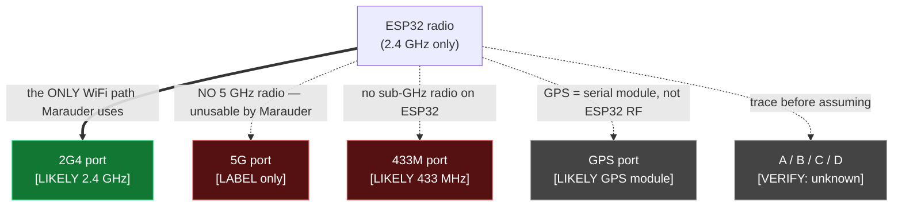
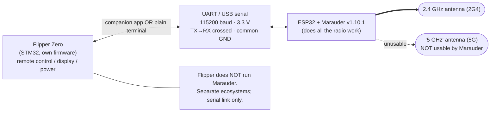
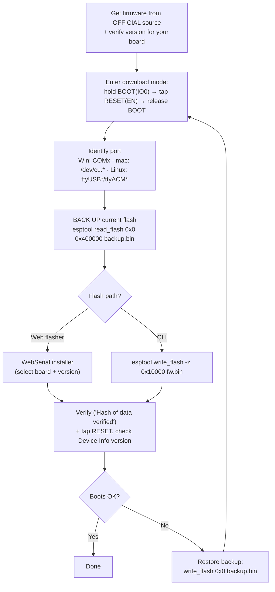
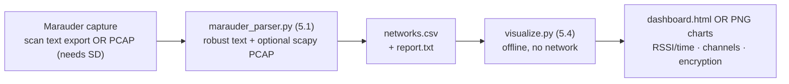

# ESP32 Marauder + MaKing Lab Multi-Band Board + Flipper Zero — Operator Guide

> **Authorized testing only.** Everything in this guide assumes you physically own the
> hardware and that you only operate it against networks you own or have **explicit written
> permission** to assess. WiFi scanning, deauthentication, and capture are regulated in many
> jurisdictions. Network discovery is one thing; transmitting frames at networks you don't own
> is another. You are responsible for staying inside the law and your engagement's rules.

This guide is written for a **security-research / educational** audience at a **practical operator
level**, with the engineering concepts layered in where they change what you actually do.

---

## 0. Index — sections → deliverables

| # | Section | Deliverable / File |
|---|---------|--------------------|
| 1 | The ESP32 Marauder stack | this document, §1 |
| 2 | The MaKing Lab multi-band board (reasoned, not invented) | this document, §2 |
| 3 | Integration reality (Flipper ⇄ ESP32) | this document, §3 |
| 4 | Operating Marauder: modes, pinout, RF | this document, §4 |
| 5.1 | Scan / PCAP parser → CSV + report | `tools/marauder_parser.py` |
| 5.2 | Flipper ⇄ ESP32 serial bridge / automation | `tools/serial_bridge.py` |
| 5.3 | Build / flash automation + procedure | `tools/flash_marauder.py` |
| 5.4 | Offline data-logging / visualization | `tools/visualize.py` |
| 6 | Visual technical guide (diagrams) | Gamma deck (link in §6) + Mermaid in §6 |
| A | Confirmed device facts | this document, Appendix A |
| B | Engineering reference notes | this document, Appendix B |

**Confirmed hardware (from the operator's own device screens):** Marauder firmware **v1.10.1** on
**Marauder v6.1** hardware, ESP-IDF `v5.5.1-710-g8410210c9a`, Station MAC `70:4B:CA:5E:00:38`,
AP MAC `70:4B:CA:5E:00:39`, SD card not connected, battery monitor supported. Full table in
Appendix A. (An earlier note called the firmware "Call Me Coco" — that's wrong; the screen reads
**Marauder**. "justcallmekoko" is the *developer's* handle, which is the likely source of the mix-up.)

---

## 1. The ESP32 Marauder stack

### 1.1 What it is

**ESP32 Marauder** is an open-source firmware (by *justcallmekoko*) that turns a cheap ESP32
microcontroller board into a handheld 2.4 GHz WiFi + Bluetooth-LE analysis tool. Your unit reports
firmware **v1.10.1** on **Marauder v6.1** hardware. It has its own menu UI on the device's screen;
it is **not** a Flipper app and does **not** need a Flipper to run (see §3).

### 1.2 The SoC

The board is built around an **ESP32** system-on-chip:

- **CPU:** dual-core processor. Classic ESP32 uses **Xtensa LX6**; the S3 variants use **Xtensa
  LX7** (and add USB-OTG). One core typically runs the WiFi/BLE stack, the other runs the
  application/UI.
- **RF front-end:** an **integrated 2.4 GHz radio** doing 802.11 b/g/n and Bluetooth/BLE. This is
  the single most important fact for an operator: **the ESP32 radio is 2.4 GHz only.**
- **Flash:** external SPI flash (commonly 4 MB) holds the bootloader, partition table, and the
  Marauder app image.
- **Connectivity:** UART, SPI, I²C, plus many GPIO pins. A USB-to-UART bridge (CP210x / CH34x) or
  native USB (S2/S3) exposes the serial console.

### 1.3 Why it is 2.4 GHz **only** — and cannot do 5 GHz WiFi

This is a hardware fact, not a firmware limitation, and no silkscreen label changes it:

- The ESP32's on-die radio and its RF matching network are designed for the **2.4 GHz ISM band**
  (~2.400–2.4835 GHz). There is **no 5 GHz PHY** on the chip.
- 802.11 a/ac/ax traffic on 5 GHz is therefore **invisible** to this device. It cannot scan, sniff,
  or transmit on 5 GHz, regardless of what antenna you screw on.
- **Operator consequence:** any "5 GHz" capability implied by the board art (the `5G` silkscreen, a
  short "5 GHz" antenna) is **not usable by Marauder.** Treat all WiFi work here as 2.4 GHz. See §3
  for why the `5G` label may exist anyway.

### 1.4 What it can and cannot do

| Can do (2.4 GHz) | Cannot do |
|---|---|
| Scan/list APs and stations | Touch 5 GHz WiFi at all |
| Sniff beacons, probes, EAPOL, raw 802.11 | Crack WPA keys for you (it captures; cracking is offline, elsewhere) |
| Send deauth / disassoc, beacon spam, probe floods *(authorized targets only)* | Inject on bands it has no radio for |
| Capture to PCAP (with SD card) | Reliably capture without an SD card — yours reads "Not Connected", so capture-to-card won't work until you insert one |
| BLE scan / spam / sniff | Be a general-purpose network adapter for your PC |

> **Note on your SD card:** Appendix A shows **SD Card: Not Connected (Size 0)**. PCAP capture
> modes write to the SD card; without one, you're limited to on-screen scan lists (which you can
> still export over serial and feed to the parser in §5.1). Insert a FAT32 SD card to enable PCAP.

---

## 2. The MaKing Lab multi-band board — reasoned from evidence

> **Discipline for this section:** I reason **only** from the silkscreen labels and physical
> evidence you can see. I do **not** invent specs. Each claim is tagged **[CONFIRMED]** (visible
> fact), **[LIKELY]** (strong inference from convention), or **[VERIFY]** (only physical inspection,
> a multimeter/continuity check, or a **VNA sweep** can settle it).

### 2.1 The silkscreen labels you reported

`433M`, `A`, `GPS`, `D`, `B`, `C`, `2G4`, `5G`, and two buttons labeled `1` and `2`.

### 2.2 What each label most plausibly means

| Label | Reading | Confidence | Notes |
|-------|---------|-----------|-------|
| `433M` | A **433 MHz** RF port (sub-GHz ISM, common for ASK/OOK remotes, LoRa-ish gear) | **[LIKELY]** | The ESP32 cannot use this — no sub-GHz radio. If anything drives it, it's a separate module or it's wired to the Flipper, not Marauder. **[VERIFY]** what it connects to. |
| `2G4` | **2.4 GHz** antenna port — the band the ESP32 actually uses | **[LIKELY]** | This is the WiFi/BLE path that matters for Marauder. **[VERIFY]** continuity to the ESP32 RF pin/U.FL. |
| `5G` | **5 GHz** antenna port | **[LIKELY]** label; **[CONFIRMED not usable by Marauder]** | The ESP32 has no 5 GHz radio (§1.3). This port is dead weight for Marauder regardless of what's attached. See §3 for why it's labeled at all. |
| `GPS` | A **GPS module / antenna** connection | **[LIKELY]** | Marauder *does* support GPS (for wardriving/geotagging) over a serial GPS module. Whether *this* port is wired to the ESP32 UART is **[VERIFY]**. |
| `A` `B` `C` `D` | Generic port/header IDs, or additional antenna/feature ports | **[VERIFY]** | Single letters are ambiguous. Could be antenna ports, GPIO breakouts, or module slots. Do not assume — trace them. |
| `1` `2` | **Buttons** | **[CONFIRMED]** they're buttons | Function inferred in §3.4. Most likely **BOOT/IO0** and **RESET/EN**. |

### 2.3 What is knowable vs. what needs a bench test

- **Knowable from the photo [CONFIRMED]:** the *labels exist* and there are two buttons. That's it
  for certainty.
- **Strong inference [LIKELY]:** `2G4` = 2.4 GHz, `5G` = 5 GHz, `433M` = 433 MHz, `GPS` = GPS. These
  follow universal RF silkscreen convention.
- **Only a bench test settles it [VERIFY]:**
  - **Which physical pad/connector goes to the ESP32's RF pin?** → continuity/inspection, ideally a
    **VNA sweep** to see which port actually resonates at 2.4 GHz.
  - **What `A/B/C/D` are.** → trace the traces.
  - **Whether `GPS`/`433M` are wired to anything Marauder drives.** → inspect + try in firmware.
  - **Antenna band identity** when antennas are unmarked → see Appendix B / §4.4 (element length is
    a hint; a **VNA is definitive**).

> **Bottom line:** Treat the MaKing Lab board as a *carrier/antenna-routing* board around the ESP32.
> For Marauder, the **only port that functionally matters is the 2.4 GHz path** (`2G4`). Everything
> else is either for other radios, for a GPS module, or unconfirmed until you trace it.

---

## 3. Integration reality — Flipper Zero ⇄ ESP32 (read this first)

### 3.1 The single most important correction

**The Flipper Zero does NOT natively run or control Marauder firmware.** They are **separate
ecosystems**:

- **Marauder** runs *on the ESP32*, with its own screen and menus.
- The **Flipper Zero** runs its own firmware on its own STM32 MCU.

Anyone expecting to "launch Marauder from the Flipper" the way you launch a Flipper sub-GHz app is
mistaken. What's real are the integration paths below.

### 3.2 The real integration paths

**(a) ESP32-as-Flipper-"WiFi dev board" companion.** The Flipper has apps (e.g. the official "WiFi
Dev Board" / "ESP32 WiFi Marauder companion" app) that talk to an ESP32 **over UART/USB** and send
it text commands, displaying responses on the Flipper screen. The Flipper is a **remote control +
display**; the ESP32 still does all the radio work with its own Marauder firmware. This is the
companion-app model and the script in §5.2 automates exactly this serial conversation.

**(b) Flipper as a serial terminal / power source only.** You can use the Flipper purely to (i)
provide 3.3 V power and ground to the ESP32 over its GPIO header, and/or (ii) act as a USB-serial
terminal to read Marauder's console. No special app logic — just pass-through.

**(c) Independent, co-located devices.** The most likely real-world situation given your photos:
the Flipper and the Marauder/MaKing-Lab board simply live in the **same carry kit** and are used
separately. They don't need each other to function.

### 3.3 The `5G` silkscreen / "5 GHz" antenna — why it's there but unusable

The ESP32 radio is 2.4 GHz only (§1.3), yet the board says `5G`. Plausible explanations, none
overclaimed:

- **Separate / unused sub-module:** the board may have been designed to host an additional radio (or
  a footprint for one) that isn't the ESP32 and isn't driven by Marauder.
- **Mislabeled or aspirational case/board art:** generic multi-band carrier boards are often silk-
  screened for every band the *form factor* could support, not what's populated.
- **Port wired to hardware Marauder doesn't drive:** the `5G` connector might physically exist and
  even carry signal to *something*, but **Marauder's firmware has no 5 GHz code path** to use it.

**Operator takeaway:** ignore `5G` for Marauder WiFi work. A short "5 GHz" antenna on that port does
nothing useful here.

### 3.4 The buttons `1` and `2`

You **cannot be 100 % certain from a photo.** The most likely mapping on an ESP32 board:

- **`1` / `2` → BOOT (IO0) and RESET (EN)**, in some order.

Safe way to confirm on the bench:

- **The button that reboots the device the instant you press it = RESET / EN.**
- **The button that only matters while powering on / does nothing during normal use = BOOT / IO0.**

Hold sequence to enter flash/download mode (used in §5.3): **hold BOOT → tap RESET → release BOOT.**

> **Don't confuse buttons with antenna ports.** The `2G4` / `5G` silkscreen, and any `1` / `2`
> printed *next to those ports*, most likely number the **antenna ports**, not the push-buttons.
> Two different things can both be labeled `1`/`2` on the same board. Trace before you assume.

---

## 4. Operating Marauder — modes, pinout, RF

### 4.1 Dependencies / Prerequisites (this whole phase)

- A charged Marauder v6.1 (battery monitor is supported per Appendix A).
- For PCAP capture: a **FAT32 SD card** inserted (yours currently reads *Not Connected*).
- For serial automation (§5.2): a **data-capable USB cable** or correct UART wiring, and the host
  tools installed.
- **Written authorization** for any target you transmit toward.

### 4.2 802.11 management-frame basics (what Marauder's modes actually do)

Marauder's WiFi modes are mostly about **802.11 management frames**, which are unencrypted and
visible even on protected networks. The concepts, then the action they enable:

| Concept (principle) | What it is | Marauder action it enables |
|---|---|---|
| **Beacon** | AP broadcasts its presence (SSID, channel, capabilities, WPS info) ~10×/sec | "Scan AP" lists networks; "Beacon spam" fabricates fake APs *(authorized testing of your own detection)* |
| **Probe request / response** | Clients ask "is network X here?"; APs answer | "Scan station"/"sniff probes" reveals client devices and the SSIDs they're looking for |
| **Deauthentication / disassociation** | Management frames that tell a client/AP to drop the link | "Deauth" disconnects a client *(only on networks you own/are authorized to test; this is the most legally sensitive mode)* |
| **WPS** | WiFi Protected Setup; advertised in beacons/IEs | The scan flags WPS-capable APs (your scan sample shows `RXd WPS Configs` lines) |
| **EAPOL / 4-way handshake** | The WPA key exchange when a client joins | Sniffing it lets you *capture* a handshake to analyze **offline elsewhere** (Marauder does not crack it) |

> **Reading your own scan output:** in Appendix B the lines like
> `AIS_WAN_2.4G: RXd WPS Configs` are **status/event lines** — they say "this SSID advertised WPS,"
> *not* "a new network appeared." The parser in §5.1 attributes the WPS flag to the matching SSID
> and does not double-count it.

### 4.3 GPIO / UART pinout and logic levels

**Principle:** the ESP32 is a **3.3 V** part. **Action:** never put **5 V** on a GPIO/UART pin — it
can destroy the input.

Default ESP32 console UART (verify against your board's pin labels):

| Signal | ESP32 pin | Direction | Wire to partner |
|--------|-----------|-----------|-----------------|
| **TX0** | GPIO1 | ESP32 → out | partner **RX** |
| **RX0** | GPIO3 | ESP32 ← in | partner **TX** |
| **GND** | GND | — | **common ground (required)** |
| **3V3** | 3V3 | power | 3.3 V only |
| **IO0 (BOOT)** | GPIO0 | strap | low at reset → download mode |
| **EN (RESET)** | EN | reset | pull low to reset |

- **Cross the data lines:** ESP32 **TX → partner RX**, ESP32 **RX ← partner TX**.
- **Flipper GPIO is also 3.3 V** → directly compatible. Still **never** introduce a 5 V source.
- Default Marauder serial console baud is **115200** (verify on your firmware).

### 4.4 Power & antenna fundamentals

- **SMA vs RP-SMA connectors:** *SMA male* has a **center pin**; *RP-SMA male* is reverse-polarity
  and has **no center pin** (the pin/socket genders are swapped). Mixing SMA and RP-SMA looks like
  it should mate but **won't connect properly**. Check before forcing anything.
- **Antenna gain:** higher-gain antennas squash the radiation pattern (more range horizontally, less
  vertically) — not "free power." Match the antenna to the band.
- **Telling 2.4 GHz from 5 GHz antennas by element length** (a quarter-wave element scales with
  wavelength):
  - **2.4 GHz:** λ/4 ≈ **3.1 cm** radiating element.
  - **5 GHz:** λ/4 ≈ **1.4 cm** radiating element.
  - A **visibly shorter** internal element usually means the **higher band**. With no markings, a
    **VNA sweep is the only definitive test.** Practically, since Marauder is 2.4 GHz-only, **use the
    longer (2.4 GHz) antenna and ignore the 5 GHz one** for WiFi work.

### 4.5 Typical on-device mode reference

> Menu names vary slightly by firmware version — confirm on **your** v1.10.1 menu. Treat
> transmit-capable modes as **authorized-targets-only**.

| Mode group | Example modes | Type | Authorization note |
|---|---|---|---|
| WiFi recon | Scan AP, Scan Station, Sniff Beacon/Probe/Raw | passive | discovery; still mind local law |
| WiFi capture | Sniff PMKID / EAPOL, save PCAP | passive (needs SD) | for offline analysis you're authorized to do |
| WiFi attack | Deauth, Beacon spam, Probe flood, Rick Roll | **transmit** | **owned / written-authorized targets only** |
| Bluetooth/BLE | BLE scan, sniff, spam | mixed | spam is transmit — authorized only |
| General | GPS data, Update, Device Info, Settings | utility | Device Info confirms your version |

---

## 5. Custom code deliverables

All four live in `tools/`. Each file has its own header, usage, dependencies, a
"what it does / does NOT do" section, and an authorized-use note. Quick map:

| File | Purpose | Key deps |
|------|---------|----------|
| `tools/marauder_parser.py` | Parse scan text **or** PCAP → CSV + readable report | stdlib; `scapy` *(optional, PCAP only)* |
| `tools/serial_bridge.py` | Flipper⇄ESP32 serial sessions, logging, scripted scans | `pyserial` |
| `tools/flash_marauder.py` | Backup + flash Marauder (web & CLI paths) + procedure | `esptool` |
| `tools/visualize.py` | Offline charts from the CSV (HTML or PNG) | stdlib; `matplotlib` *(optional, PNG only)* |

### 5.1 Parser — `tools/marauder_parser.py`

Handles the noisy on-screen AP scan (two interleaved line formats from Appendix B) and, optionally,
PCAP from sniff modes. Output: `networks.csv` + a human-readable report. Verified against the
Appendix B sample: it dedupes repeated SSIDs, keeps the strongest RSSI, attributes
`RXd WPS Configs` to the right SSID, recognizes raw-BSSID rows, and skips garbled lines safely.

```bash
python3 tools/marauder_parser.py --text scan_dump.txt --csv networks.csv --report report.txt
# PCAP (needs scapy):
python3 tools/marauder_parser.py --pcap beacons.pcap --csv networks.csv
```

### 5.2 Serial bridge — `tools/serial_bridge.py`

Opens a **115200**-baud session to the ESP32 (UART0: GPIO1=TX, GPIO3=RX, cross TX↔RX, common GND,
3.3 V), sends a **safe default command set**, logs every line with timestamps, and runs scripted
sequences (timed scan → stop → dump). Transmit/attack commands are deliberately *not* in the safe
set; you must pass them explicitly and own the authorization.

```bash
python3 tools/serial_bridge.py --list
python3 tools/serial_bridge.py --port /dev/ttyUSB0 --baud 115200 --interactive
python3 tools/serial_bridge.py --port /dev/ttyUSB0 --script scan --duration 20 --log session.log
```

### 5.3 Flash automation — `tools/flash_marauder.py`

Covers **both** the **web-flasher path** and the **`esptool` CLI path**, plus the hardware-button
download-mode sequence (**hold BOOT → tap RESET → release BOOT**), per-OS port identification
(`COMx` / `/dev/cu.*` / `/dev/ttyUSB*`|`ttyACM*`), and a **backup-first / verify / rollback** flow.

```bash
python3 tools/flash_marauder.py --procedure          # print the full step-by-step
python3 tools/flash_marauder.py --list-ports
python3 tools/flash_marauder.py --port /dev/ttyUSB0 --backup backup_4MB.bin --flash-size 4MB
python3 tools/flash_marauder.py --port /dev/ttyUSB0 --firmware esp32_marauder.bin --offset 0x10000 --verify
```

> **Firmware source caveat:** download Marauder **only** from the official project and **verify the
> current version/tooling** for your board variant — do not trust offsets or versions baked into any
> guide (including this one). Official: `github.com/justcallmekoko/ESP32Marauder` and the project's
> web flasher.

### 5.4 Visualization — `tools/visualize.py`

Reads the parser CSV and renders **RSSI-over-time per network**, **channel occupancy**, and
**encryption distribution**. Default output is a **single self-contained HTML dashboard** drawn with
vanilla `<canvas>` — **no external network calls, no CDNs**. A `--png` mode uses matplotlib if you
prefer static images.

```bash
python3 tools/visualize.py --csv networks.csv --html dashboard.html      # offline, no deps
python3 tools/visualize.py --csv networks.csv --png --outdir charts/     # needs matplotlib
```

---

## 6. Visual technical guide

A Gamma visual guide was generated with the five required diagrams (ESP32 block diagram, RF band
routing with the 2.4 GHz-only caveat, device-interop flow, flashing workflow, and the data
pipeline). **The Gamma link is provided in the chat response that accompanies this file.**

The same five diagrams are reproduced here as **Mermaid** so the guide is self-contained even if the
Gamma link is unavailable.

### 6.1 ESP32 internal block diagram



### 6.2 RF band routing on the MaKing Lab board (with 2.4 GHz-only caveat)



### 6.3 Device-interop flow (Flipper ⇄ ESP32 ⇄ antennas)



### 6.4 Flashing-workflow flowchart



### 6.5 Data-pipeline diagram



---

## Appendix A — Confirmed device facts (ground truth, do not contradict)

| Field | Value (confirmed on-device) |
|-------|-----------------------------|
| Firmware | Marauder |
| Version | v1.10.1 |
| Hardware | Marauder v6.1 |
| ESP-IDF | v5.5.1-710-g8410210c9a (as displayed) |
| WSL Bypass | enabled |
| Station MAC | 70:4B:CA:5E:00:38 |
| AP MAC | 70:4B:CA:5E:00:39 |
| SD Card | Not Connected (Size 0) |
| Battery Monitor | supported |

---

## Appendix B — Engineering reference notes

- **2.4 vs 5 GHz antenna ID:** quarter-wave element ≈ **3.1 cm @ 2.4 GHz**, ≈ **1.4 cm @ 5 GHz**.
  Shorter element ⇒ higher band; **VNA sweep is definitive**. Marauder is 2.4 GHz-only, so use the
  longer antenna.
- **Connector check:** **SMA** male has a center pin; **RP-SMA** male has none (reverse polarity).
  Mixing them prevents a proper connection.
- **Logic levels:** ESP32 and Flipper GPIO are both **3.3 V** (compatible). **Never** apply **5 V**
  to these lines.
- **Confidence tags used in §2:** **[CONFIRMED]** = visible fact · **[LIKELY]** = strong convention-
  based inference · **[VERIFY]** = needs physical inspection / continuity / VNA.
